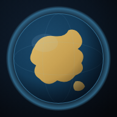
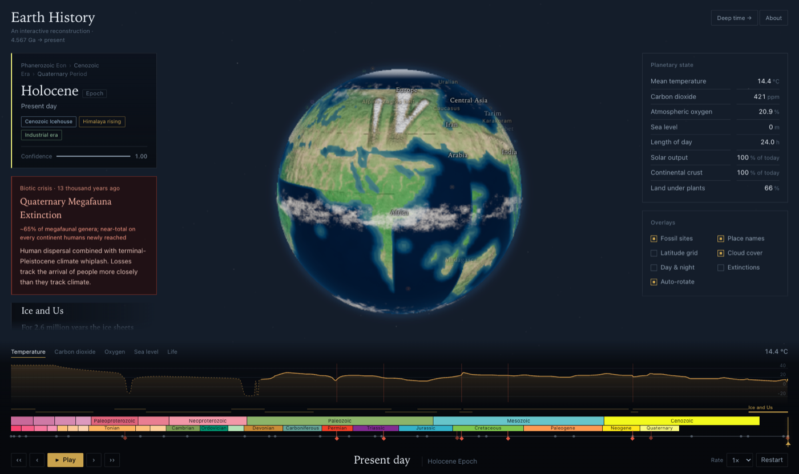
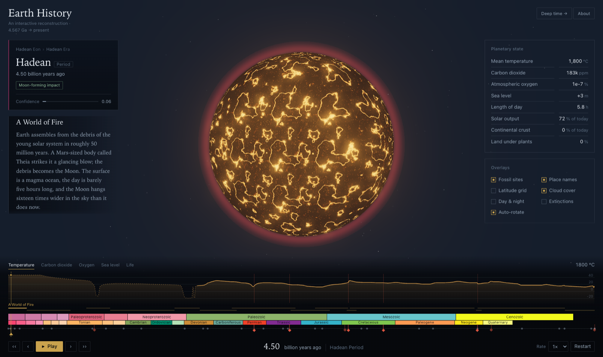
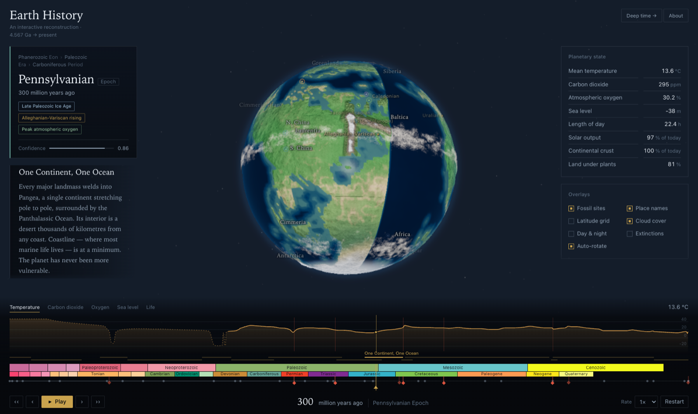
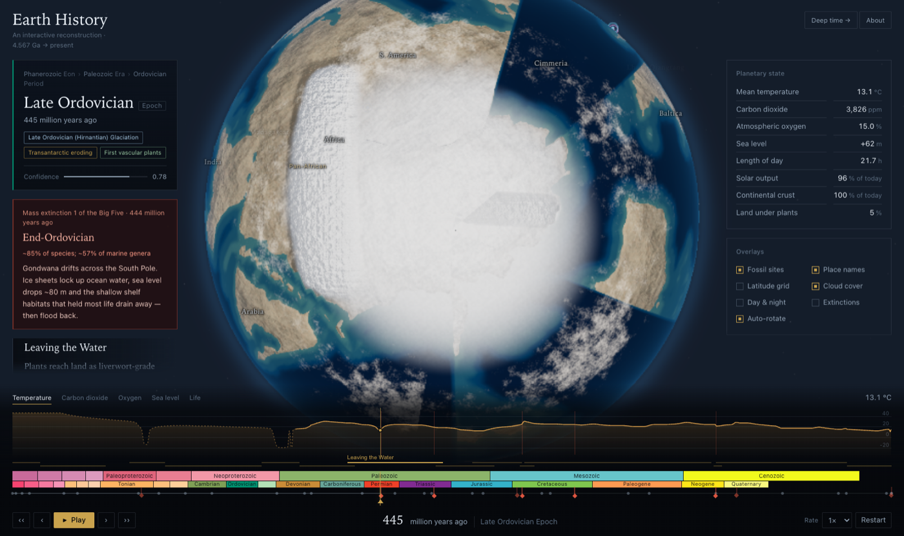
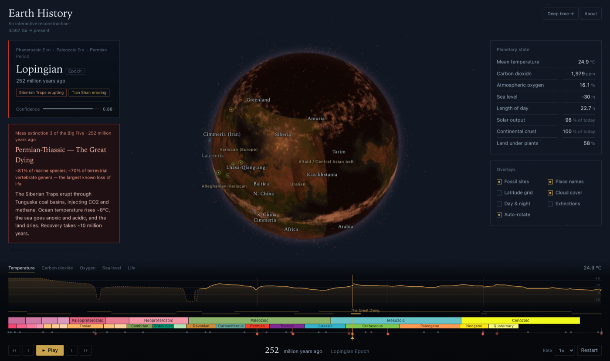

<div align="center">



# Earth History

**Four and a half billion years of the planet's surface, rebuilt in the browser and driven by a chronostratigraphic chart you can drag.**

[&nbsp;**▶&nbsp;&nbsp;Open the live exhibit**&nbsp;](https://rahman-tawhid.github.io/earth-history/)

&nbsp;


<br />



</div>

---

Drag the timeline back to 300 million years ago and every continent has welded into Pangaea, a single landmass reaching pole to pole; its interior is desert a thousand kilometres from any coast, atmospheric oxygen stands above 30%, and the day is ninety minutes short of ours. Nudge the chart forward and the supercontinent tears open under the cursor, the Atlantic widening one interpolated keyframe at a time. Every figure on screen — the temperature, the sea level, the length of the day — is read from a published curve, and the epoch panel tells you how far to trust it.

This is a scientifically grounded reconstruction of Earth's surface from accretion to the present, built as a single client-side WebGL page. No backend, no accounts, no network calls once it loads. It is aimed at the undergraduate learning historical geology, the educator who needs a figure that will survive a specialist's eye, and the museum visitor who should be able to understand the Great Dying without being told what to conclude.

<div align="center">

<table>
  <tr>
    <td width="50%"></td>
    <td width="50%"></td>
  </tr>
  <tr>
    <td align="center"><b>4.50 Ga</b> · a magma ocean, a five-hour day, the Moon sixteen times wider in the sky</td>
    <td align="center"><b>300 Ma</b> · one continent, one ocean, oxygen at its all-time peak</td>
  </tr>
  <tr>
    <td width="50%"></td>
    <td width="50%"></td>
  </tr>
  <tr>
    <td align="center"><b>445 Ma</b> · an ice cap sits on the Sahara, because the Sahara sits on the pole</td>
    <td align="center"><b>252 Ma</b> · the end-Permian, the largest extinction in the record</td>
  </tr>
</table>

</div>

## A reconstruction, not a slideshow

The easy way to animate deep time is to crossfade between a dozen pre-drawn palaeogeographic maps. This does what plate reconstructions actually do. Fourteen rigid continental blocks each carry their own outline and a list of palaeopositions, welded into a parent hierarchy so that Gondwana moves as one body. Rotations interpolate as quaternions, so the continents travel continuously along their polar-wander paths rather than dissolving into one another, and Pangaea assembles because each block is solved against an inter-block distance constraint to an already-fitted neighbour — Laurentia lands beside Africa, not 149° away from it.

The coastlines are real. A bake step takes Natural Earth's 1:50m land, gives every land pixel to the tectonic block that owns it, and writes each block's own coastline into a packed atlas. The rendered surface agrees with Natural Earth across **99.5% of the globe's area**, checked texel by texel, and every named strait from Gibraltar to the Bering is asserted open or closed at the right age — because land recall alone will happily score an island welded to its mainland as correctly drawn.

## The surface is computed, not painted

Once the geometry is right, everything on it follows from that geometry rather than being authored epoch by epoch. This is why the reconstruction holds together instead of drifting into decoration.

- **Ice** is read from the latitude a point occupies *now*, so the Gondwanan ice sheet appears on the Ordovician Sahara without anyone drawing it there, then follows the continent onto whichever pole it crosses.
- **Aridity** combines distance from the nearest coast with the subtropical dry belts, so Pangaea grows a continental desert because it is vast, and loses it when it rifts.
- **Flooding** applies the eustatic sea-level curve to a hypsometric profile, so the Cretaceous highstand opens seaways across the continents and the Permian lowstand drains the shelves back out.
- **Vegetation** follows its own curve: nothing on land is green before the Silurian, because that is when land plants arrive.
- **Mountains** are twenty-seven belts, each a ridge with a strike, a length and a width, rising and eroding on schedule. The Alpine–Himalayan chain runs unbroken from Anatolia through the Zagros, Pamir and Karakoram onto Tibet, and lifts between 50 Ma and now. A belt still rising renders as bare rock; one past its peak has had time to weather and grow a forest.

## What you can read off it

A live planetary-state panel reports mean temperature, CO₂, oxygen, sea level, day length, solar luminosity, continental crust and vegetated land, each drawn from a cited compilation and interpolated monotonically so the numbers never overshoot between control points. The chronostratigraphic chart along the bottom **is** the scrubber: eon, era, period and epoch in their official ICS v2023/09 colours, 4 eons and 34 epochs deep, directly draggable, with the non-linear scale giving the Phanerozoic two-thirds of the rail. Fourteen narrative chapters lie over the ages they describe and fly the globe to the place that matters. The five formal mass extinctions and four further crises are marked on the rail and open with a rank, a loss estimate and a cause. Large igneous provinces erupt on cue and redden the sky; the Chicxulub impact plays as a cinematic when time crosses 66 Ma. A second view, **Deep time**, lays the whole 4.567 Ga on one honest linear rail — a single pixels-per-million-years, stated in the header, so that "3.7 billion years" is never drawn shorter than "2.8 million years", with the same history offered as a 4.6-kilometre walk for anyone who thinks better in metres.

Every reading carries a confidence that falls as you travel back, and the known limits are stated inside the interface, not buried here.

## Install it

The exhibit is a Progressive Web App. On a phone or tablet, open the link in the browser and choose **Add to Home Screen**; it then launches chromeless and runs entirely offline, since a service worker precaches all fifteen files on the first visit and the app makes no network requests at runtime. On the desktop it installs the same way from the browser's address bar.

## Under the hood

| Layer | Choice |
|---|---|
| 3D | Three.js r160 |
| Shading | Custom GLSL — a surface compositor plus earth, atmosphere and cloud shaders |
| Build | Vite 8 (Rolldown) |
| UI | DOM overlay and a canvas chart, no framework, no charting or tweening library |
| Tests | Playwright |
| Runtime | Zero network requests · payload under 250 kB gzipped excluding the Three.js chunk |

The surface is composited on the GPU. For each equirectangular texel the compositor rotates the point into every block's frame, samples the baked atlas, takes the nearest land, adds the orogens, and emits land, elevation and inland distance in one pass. That pass re-renders only when the age changes — at half resolution while scrubbing, full resolution once it settles — and the earth shader reads the result to lay down bathymetry, biomes by local temperature and aridity, ice by latitude and lapse rate, terrain normals, limb scattering and the magma glow of the Hadean.

```
plates.json ──▶ rasterise once ──▶ packed atlas (land mask + signed coast distance)
                                              │
timeline scrub ──▶ interpolate block quaternions
                                              ▼
                    composite pass: rotate each texel into every block's frame,
                    sample the atlas, take nearest land, add orogens
                                              │
                                              ▼
              earth shader: bathymetry · biomes · ice · terrain · atmosphere
```

## Verification

The reconstruction is held to **456 assertions across seven suites**, and a change is not finished until every one passes.

| Suite | What it holds to account |
|---|---|
| `geography` | Modern land and sea resolve at forty named places; the globe is not mirrored east–west. |
| `coastline` | The rendered land mask against Natural Earth, texel by texel, to 99.5% — and recall region by region from Sri Lanka to Antarctica. |
| `straits` | Fifty-four named water bodies and isthmuses, so a filled-in strait cannot hide behind a land-recall score. |
| `palaeolatitude` | Diagnostic constraints, supercontinent assembly fits, polar-land checks, orogeny schedules, chain continuity, antipodal-ghost guards and a motion-continuity check that catches keyframe jumps. |
| `smoke` | Unit resolution, the scrubber, playback, keyboard, overlays, chapters and deep links. |
| `responsive` | Both site layouts through eleven viewports from 1920 down to 375 px, in three layout modes, plus bottom sheets, safe areas and 44 px touch targets. |
| `deeptime` | Samples the rendered canvas and asserts the dinosaur bar measures 59.6× the *Homo* bar at every named scale — one scale on screen, always. |

The palaeolatitude suite is the demanding one. It requires the Sahara to sit on the South Pole in the Hirnantian, Illinois to straddle the equator through the Carboniferous coal swamps, India to cross the equator at 50 Ma, and Chicxulub to be at 20°N when it is struck — and it requires the sutures to close and open on time, the Iapetus Ocean open before the Caledonian orogeny shuts it.

## Accuracy and its limits

The reconstruction is illustrative, not survey-grade, and it says so in its own **Sources & method** dialog. Palaeopositions are read off published models and generalised to block centroids, good to roughly 5–10° through the Phanerozoic and looser before 600 Ma. Palaeolongitude before the Mesozoic is weakly constrained and should be read as relative. Coastlines are modern outlines carried back rigidly — real blocks deform, gain terranes and lose margins, and none of that is modelled; ocean basins, island arcs and microcontinents are absent; relief is exaggerated some forty times; and Precambrian temperature and CO₂ are model output rather than measurement. Water narrower than about 25 km — Gibraltar, the Bosphorus — falls under a single screen pixel and reads as closed.

None of that is hidden from the visitor. The confidence figure falls as the age climbs, the poorly constrained intervals are drawn differently on the chart, and the dialog lists every caveat above.

---

<div align="center">

This repository holds the compiled, installable build, served through GitHub Pages.<br />
Built by <a href="https://github.com/rahman-tawhid">Tawhid Rahman</a> · every number on screen is read from a published curve.

</div>
